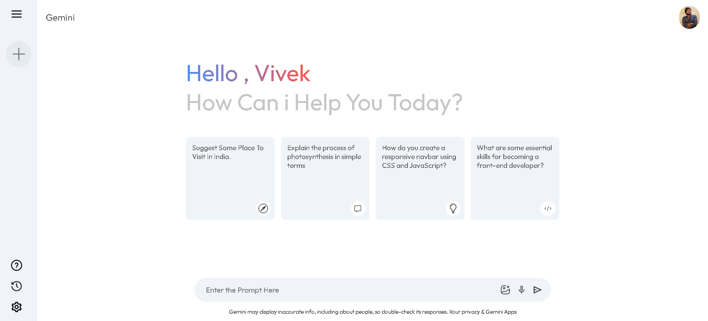

# Gemini Clone

Gemini Clone is a React-based web application designed to replicate the Google Gemini chatbot's functionality. This project integrates the Google Gemini API, offering a chat interface where users can engage in interactive conversations, powered by Gemini's AI capabilities.

## Table of Contents

- [Project Overview](#project-overview)
- [Key Features](#key-features)
    - [Primary Features](#primary-features)
    - [Optional Enhancements](#optional-enhancements)
    - [Future Improvements](#future-improvements)
- [Project Preview](#project-preview)
- [Live Demo](#live-demo)
- [Setup & Installation](#setup-installation)
- [Contributing](#contributing)
- [License](#license)

## Project Overview

The goal of Gemini Clone is to provide a clean, intuitive interface where users can chat with an AI modeled after Google’s Gemini. The app focuses on creating a conversational experience with simulated typing effects and the power of Google's AI responses. Built using React and styled with CSS, this project leverages modern web technologies to deliver an engaging user experience.

## Key Features

### Primary Features

- **Interactive Chat Interface**: A responsive, user-friendly chat window for seamless interaction with the Gemini model.
- **Typing Simulation**: A realistic typing effect that mimics the natural delay of human-like responses.
- **Google Gemini Integration**: The app uses the Google Gemini API to generate intelligent and contextually relevant responses.

### Optional Enhancements

- **React Framework**: The application is built with React to ensure fast, component-driven development and efficient state management.
- **Custom CSS Styling**: The UI is styled with CSS to ensure a clean, modern look that enhances usability and accessibility.

### Future Improvements

- **Conversation History**: Allow users to view their previous interactions with the chatbot.
- **Enhanced UI Features**: Plan to integrate media elements like emojis, text formatting options, and user avatars for a more engaging chat experience.
- **Expanded Functionalities**: Future versions could include features like image search, language translation, or voice-based interaction.

## Project Preview

Here's a preview of the Gemini Clone in action:



## Live Demo

You can try the Gemini Clone live at the following link:

[Gemini Clone Demo](http://localhost:5180/)

## Setup & Installation

To run Gemini Clone locally, follow these steps:

1. **Clone the Repository**:

   First, clone the project to your local machine:

   ```bash
   git clone <>
